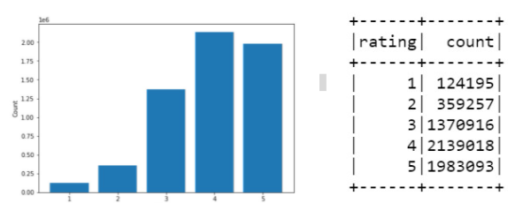

# book-recommendation-system
A book recommendation system built using Pyspark to assist the users by suggesting books of their relevant interests as well as predicting the user rating for a particular book.

This project was implemented as a part of the Big Data Analytics course taken at Concordia University. 
It uses content-based and collaborative filtering approaches.

## Code Structure
- `model`
        -  `dataExploration.ipynb`
        - `data_preprocessing.ipynb`
        - `content_based.ipynb` - model 1
        - `collaborative_filtering.ipynb` - model 2

## Data Preprocessing
### Data Cleaning
The **ratings** dataset does not contain any null or invalid values, hence no data cleaning is required. However, the book and book tag dataset include multiple null and invalid data.

### Data Imbalance
As illustrated in fig 1, there is a data imbalance, with the rating values (e.g., 1, 2) being very low. Therefore, we look at various techniques (Resample, k-fold cross-validation, etc ) for dealing with data imbalance.

<em>Fig 1:</em> illustrates the data imbalance in our dataset

## Model 1: Content-based
*Advantage*: No cold start, able to recommend new and unpopular books  
*Disadvantage*: Difficult to recommend to new users

### One-Hot Vector Encoding
To deal with categorical data, we perform one-hot vector encoding to build our item and user profile.

### Algorithm
Using cosine distance, we recommend books to users similar to previous books highly rated by the user.
* Item profile: The item profile is built with a column having values ranging from 0 to 1 for each distinct category of the book features.
* User profile: The user profile is the aggregate of the item profiles of books that the user has highly rated, normalized to the range 0-1.

## Model 2: Collaborative Filtering
*Advantage*: Feature selection is not needed, and it helps users discover new interests.  
*Disadvantage*: Cold start problem, popularity bias

### Algorithms
Matrix Factorization - Generate latent features and identify relationships between users and items based on other user’s interactions.

### Evaluation metrics 
* Root mean squared error
* Confusion Matrix

### Dataset Used: goodbooks-10k
Reference: https://github.com/zygmuntz/goodbooks-10k/blob/master/quick_look.ipynb
